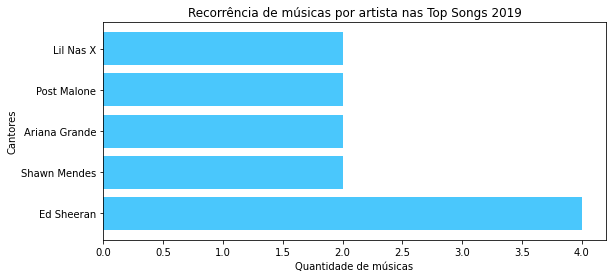
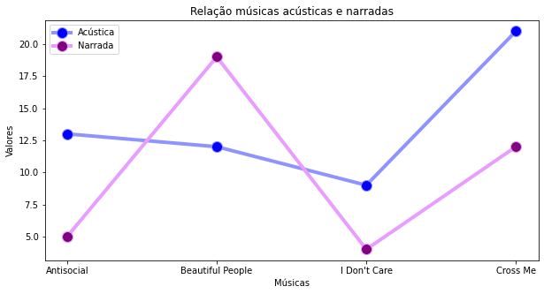
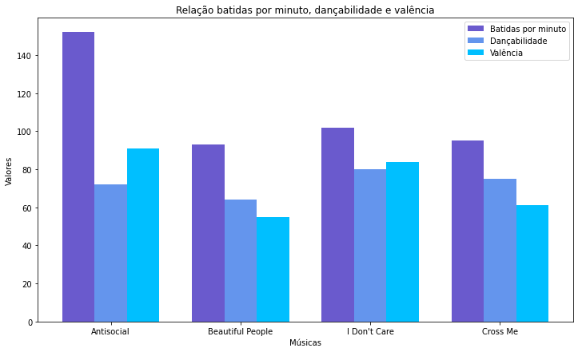

# 🎼 Top Songs Spotify 2019

O Spotify libera a retrospectiva das músicas de cada usuário, então quem quiser pode saber quais músicas mais ouviu durante o ano e essas serão suas Top Songs. Nos últimos anos várias pessoas têm postado nas redes sociais suas músicas e cantores mais ouvidos. Isso me gerou uma curiosidade, na última lista de Top Songs do Spotify em 2019, deve ter algum cantor mais tocado que os outros. 
**Então, nas Top Songs do Spotify, quais os cantores mais recorrentes?**

Entre os 5 cantores mais recorrentes, Ed Sheeran tem o dobro de músicas nas Top Songs.

Com quatro músicas entre as mais populares de 2019, Ed Sheeran se destaca entre os demais cantores, o que me gerou ainda mais curiosidade. O que as músicas dele tem para conseguir tanto sucesso em um só ano? 
Como um todo, podemos notar que suas músicas são mais acústicas do que narradas. 
**Vamos ver o comportamento dessas duas métricas nas suas músicas mais populares de 2019**

 

Apenas na música "Beautiful People" esse padrão não ocorre. Entretanto, como a maior parte de suas músicas é mais acústica, pode-se notar também, que suas músicas no geral tem bastante musicalidade e ritmo. 
**Será que um maior número de batidas por minuto e dançabilidade significam que suas músicas são mais positivas(alta valência)?**

### :star: Conclusões

Logo percebemos que por mais que as músicas de Ed Sheeran tenham muitas batidas por minuto e relativa dançabilidade, não significa que elas terão alta valência, tendo em vista suas músicas mais reflexivas, com mensagens que nem sempre são positivas.

Para mais análises, os dados estão [aqui](https://www.kaggle.com/leonardopena/top50spotify2019).

